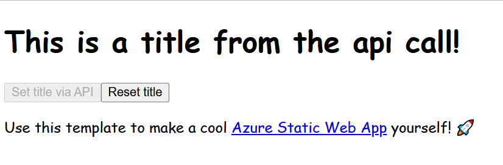

# Azure Static Web App Template with Node.js API

This is a template repository for creating [Azure Static Web Apps](https://docs.microsoft.com/azure/static-web-apps/) that comes pre-configured with:

* [Vue.js v3](https://v3.vuejs.org/)
* [Vue Router v4](https://next.router.vuejs.org/)
* [Vuex v4](https://next.vuex.vuejs.org/)
* [A Node.js Azure Function](https://docs.microsoft.com/azure/static-web-apps/apis)
* [Vite.js](https://vitejs.dev/)

---

## Template

This template contains a minimal Vue.js based application with a component that displays an `h1` element, two `button`s and a paragraph. The text for the `h1` is retrieved from the Vuex store. It's either a default value or a value retrieved via the `getTitleFromApi` function, located in the `api` folder.




Live version [running in Azure](https://brave-water-026f39a03.azurestaticapps.net/).

---

## Running Azure Static Web Apps locally

1. To install the dependencies run:

  ```shell
  npm run init
  ```

2. Navigate to the `api` folder and add a file named `local.settings.json` with this content:

  ```json
  {
    "IsEncrypted": false,
    "Values": {
      "AzureWebJobsStorage": "",
      "FUNCTIONS_WORKER_RUNTIME": "node"
    }
  }
  ```

  > This file is .gitignored since it is used to store connection strings and secrets.

3. To run everything type:

  ```shell
  npm run all
  ```

  > This starts the Vue app on `localhost:3000`, the Node Azure Function on `localhost:7071`, and the Static Web App on `localhost:4280`.

  > If you need to change the port numbers, please edit them in the `package.json` scripts section.

4. View the Static Web App on [`http://localhost:4280`](http://localhost:4280).
